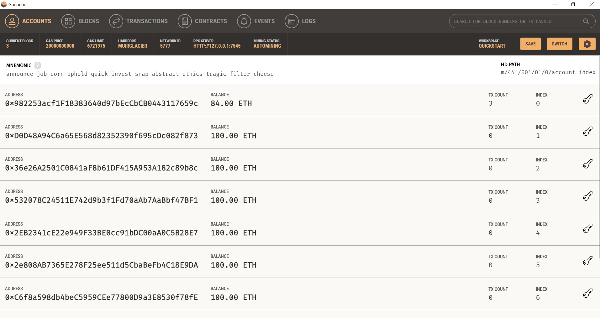
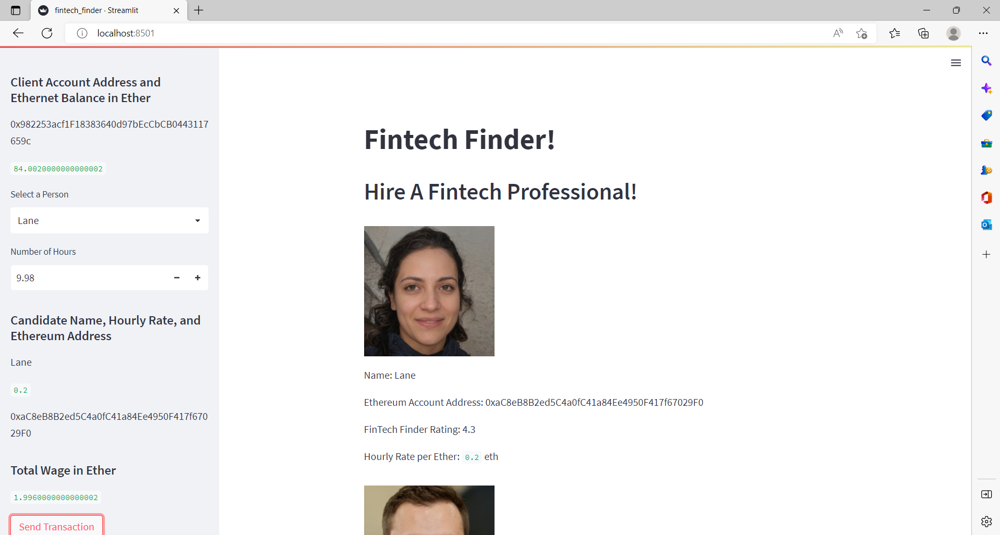
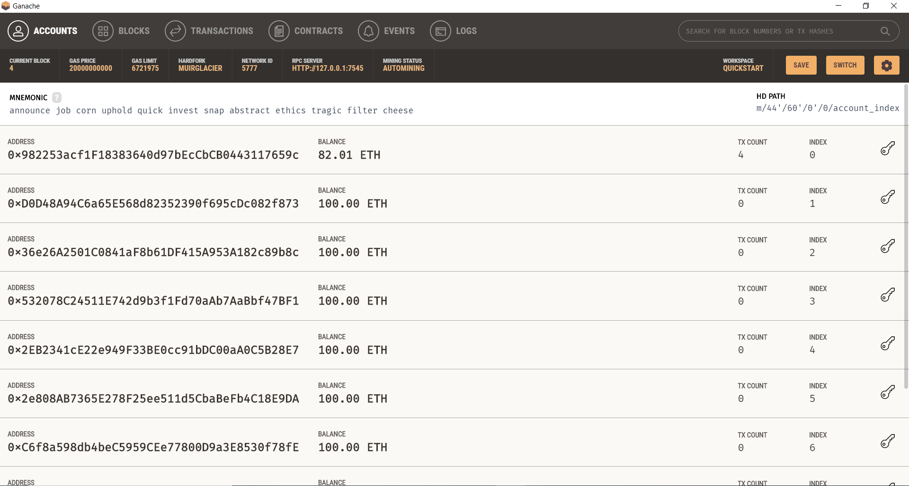

# Fintech Finder Application

The Fintech Finder application in `fintech_finder.py` and associated functions in `crypto_wallet.py` create a web application with streamlit that enables the user to send cryptocurrency payments to professionals that they "hire" from the app.  

## Technologies

This program is written in Python (3.7.13) and developed in VS Code on a Windows computer. Additional libraries used in this application are requests, dotenv, bip44, web3, streamlit, dataclasses, and typing. Also, make sure that you have Ganache installed on your local computer. 

## Installation Guide

Downloading the code & associated files using `git clone` from the repository is sufficient to download the Jupyter Notebook, ensure that the associated libaries (see Technologies section) are installed on your machine as well.  

## Usage

Make sure that you have a `.env` file set up in your root directory with the mnemonic used for your crypto wallet. A sample file is included for reference.

After activating your development environment, you can run the application simply by typing `streamlit run fintech_finder.py` from your command line. Make sure that you're in the root folder for the application and that your development environment with streamlit and other associated libraries are installed. 

After running the application, your default browser should show you the application from your localhost address.

After comparing services with the streamlit application, you can select the professional that you want to hire and estimate the amount of Ether you will need to complete the transaction. Clicking 'send transaction' on the web interface will send your payment to the professional that you've selected, and you can track the payment withdrawal from your account with Ganache. 

For example, here's a screenshot of Ganache before making a selection with the application: 

Here is what the application looks like after making a selection: 

Afer making the selection and refreshing the web page, Ganache will update your balance: 

## Contributors

Project contributors are the Rice FinTech bootcamp program team (instructor Eric Cadena) who developed the tasks for this project along with myself (Paula K) who's written the code in the workbook.
